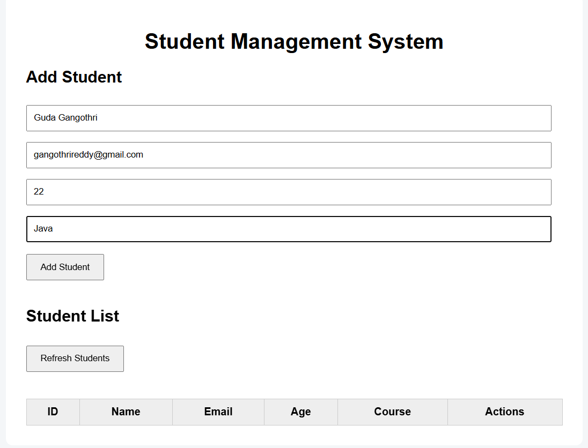
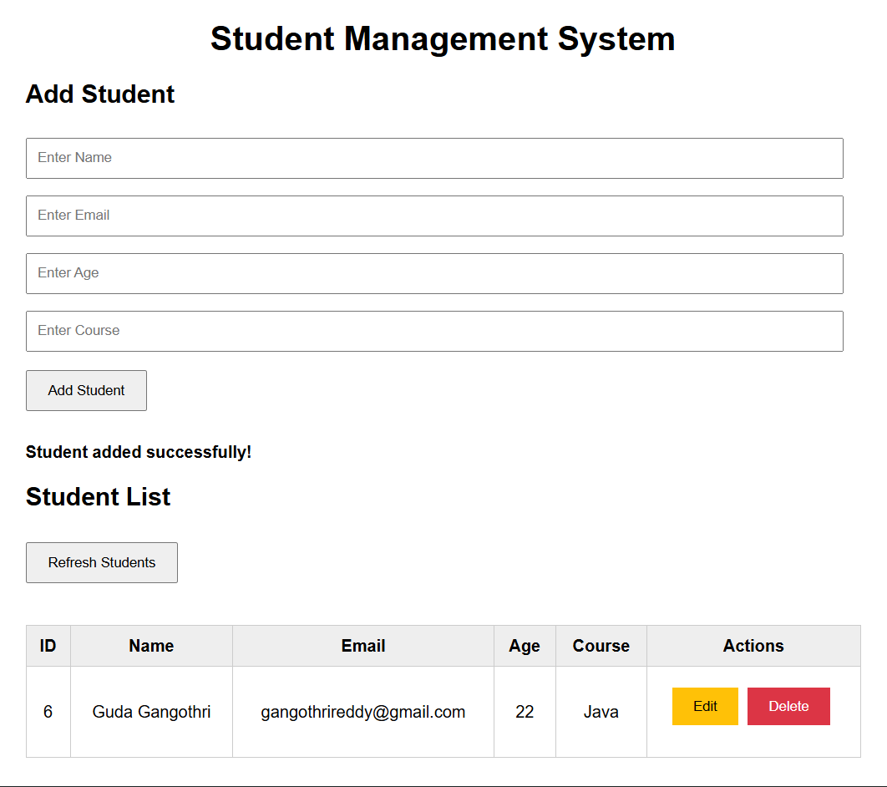
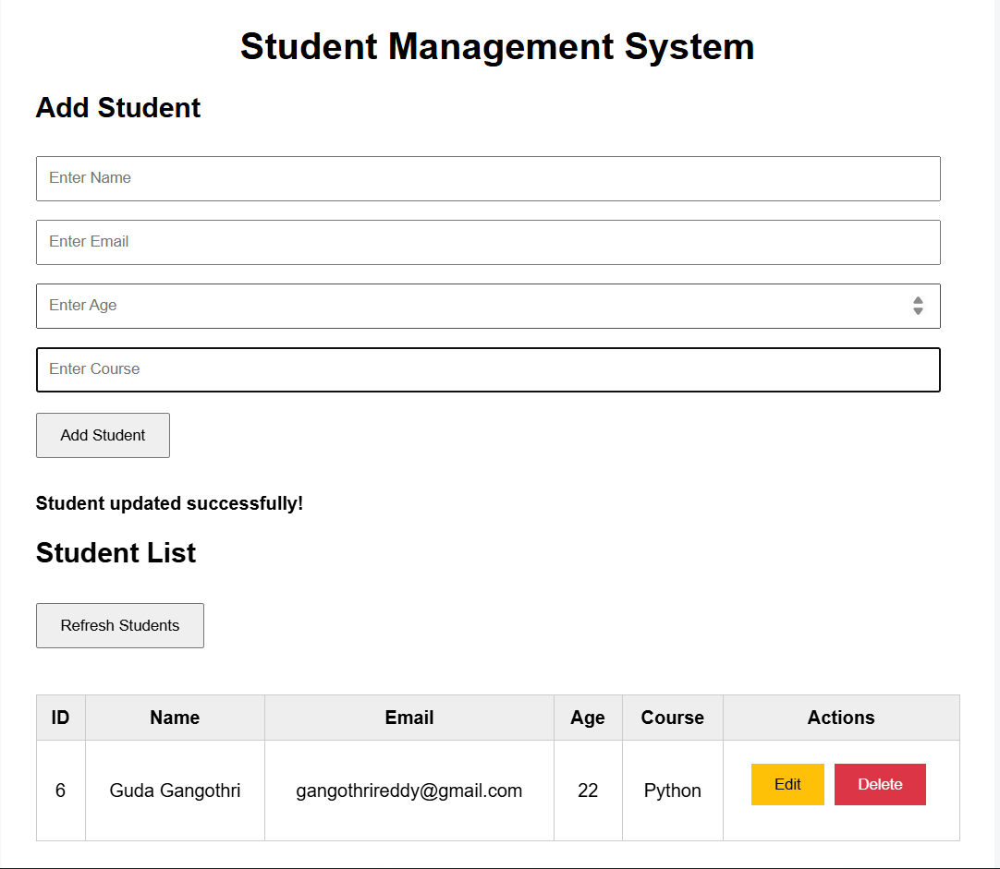
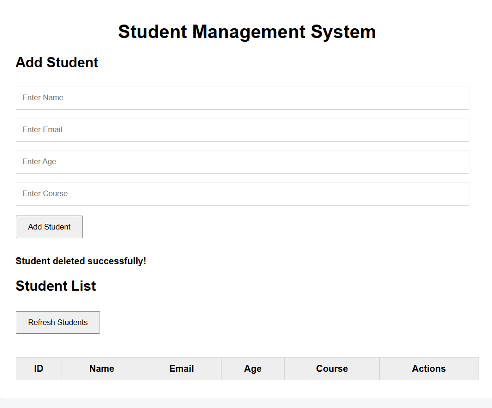

# Student Management System

A full-stack **Student Management System** developed using **Java, Spring Boot, Spring Data JPA, Hibernate, MySQL, HTML, CSS, and JavaScript**.

---

## Project Overview

The Student Management System is a web-based application used to manage student information.

The application allows users to:

- Add a new student
- View all students
- View a student by ID
- Update student details
- Delete student details
- Refresh the student list
- Store student information in MySQL
- Connect the frontend with the Spring Boot REST API

---

## Features

- Add Student
- View All Students
- View Student by ID
- Update Student
- Delete Student
- Refresh Student List
- Display success messages
- REST API integration
- MySQL database integration
- Frontend and backend integration
- Complete CRUD operations

---

## Technologies Used

### Backend

- Java 21
- Spring Boot
- Spring Web
- Spring Data JPA
- Hibernate
- Maven

### Database

- MySQL
- MySQL Workbench

### Frontend

- HTML5
- CSS3
- JavaScript
- Fetch API

### Tools

- Eclipse
- Postman
- Google Chrome
- Git
- GitHub

---

## Complete Project Structure

```text
student-rest-api/
│
├── src/
│   │
│   ├── main/
│   │   │
│   │   ├── java/
│   │   │   │
│   │   │   └── com/
│   │   │       └── example/
│   │   │           └── studentapi/
│   │   │               │
│   │   │               ├── StudentRestApiApplication.java
│   │   │               ├── Student.java
│   │   │               ├── StudentRepository.java
│   │   │               └── StudentController.java
│   │   │
│   │   └── resources/
│   │       │
│   │       ├── application.properties
│   │       │
│   │       └── static/
│   │           └── index.html
│   │
│   └── test/
│
├── screenshots/
│   ├── 01-add-student-form.png
│   ├── 02-student-added.png
│   ├── 03-student-update.png
│   └── 04-student-delete.png
│
├── pom.xml
├── README.md
└── .gitignore
```

---

## Important Project Files

### StudentRestApiApplication.java

Main Spring Boot application class used to start the application.

### Student.java

JPA Entity class representing student information.

The student contains:

- ID
- Name
- Email
- Age
- Course

### StudentRepository.java

Repository interface used to communicate with the database using Spring Data JPA.

It performs database operations such as:

- Save student
- Find students
- Find student by ID
- Update student
- Delete student

### StudentController.java

REST Controller responsible for handling:

- POST requests
- GET requests
- PUT requests
- DELETE requests

### application.properties

Contains:

- MySQL database URL
- Database username
- Database password
- JPA configuration
- Hibernate configuration

### index.html

Frontend page containing:

- Add Student form
- Student List
- Refresh Students button
- Edit button
- Delete button

---

## Database Details

The application uses **MySQL** as the relational database.

### Database Name

```text
student_springrest_api
```

### Create Database

Open MySQL Workbench and execute:

```sql
CREATE DATABASE student_springrest_api;
```

Select the database:

```sql
USE student_springrest_api;
```

The Student table is managed using **Spring Data JPA and Hibernate**.

---

## Student Table

| Column | Data Type | Description |
|---|---|---|
| id | BIGINT | Unique student ID |
| name | VARCHAR | Student name |
| email | VARCHAR | Student email |
| age | INT | Student age |
| course | VARCHAR | Student course |

### Example Student Data

| ID | Name | Email | Age | Course |
|---|---|---|---|---|
| 6 | Guda Gangothri | gangothrireddy@gmail.com | 22 | Python |

---

## Database Configuration

Database configuration is stored in:

```text
src/main/resources/application.properties
```

Example:

```properties
spring.datasource.url=jdbc:mysql://localhost:3306/student_springrest_api
spring.datasource.username=root
spring.datasource.password=YOUR_PASSWORD

spring.jpa.hibernate.ddl-auto=update
spring.jpa.show-sql=true
spring.jpa.properties.hibernate.dialect=org.hibernate.dialect.MySQLDialect
```

Replace `YOUR_PASSWORD` with your local MySQL password.

### Database Security

Do not upload your real MySQL password to GitHub.

For a public repository, use an environment variable:

```properties
spring.datasource.password=${DB_PASSWORD}
```

---

## REST API Endpoints

| Operation | HTTP Method | Endpoint |
|---|---|---|
| Create Student | POST | `/students` |
| Get All Students | GET | `/students` |
| Get Student by ID | GET | `/students/{id}` |
| Update Student | PUT | `/students/{id}` |
| Delete Student | DELETE | `/students/{id}` |

---

## Create Student

**HTTP Method:** `POST`

**Endpoint:**

```text
/students
```

**URL:**

```text
http://localhost:8080/students
```

**Request Body:**

```json
{
  "name": "Guda Gangothri",
  "email": "gangothrireddy@gmail.com",
  "age": 22,
  "course": "Java"
}
```

**Example Response:**

```json
{
  "id": 1,
  "name": "Guda Gangothri",
  "email": "gangothrireddy@gmail.com",
  "age": 22,
  "course": "Java"
}
```

---

## Get All Students

**HTTP Method:** `GET`

**Endpoint:**

```text
/students
```

**URL:**

```text
http://localhost:8080/students
```

**Example Response:**

```json
[
  {
    "id": 1,
    "name": "Guda Gangothri",
    "email": "gangothrireddy@gmail.com",
    "age": 22,
    "course": "Java"
  }
]
```

---

## Get Student by ID

**HTTP Method:** `GET`

**Endpoint:**

```text
/students/{id}
```

**Example URL:**

```text
http://localhost:8080/students/1
```

**Example Response:**

```json
{
  "id": 1,
  "name": "Guda Gangothri",
  "email": "gangothrireddy@gmail.com",
  "age": 22,
  "course": "Java"
}
```

---

## Update Student

**HTTP Method:** `PUT`

**Endpoint:**

```text
/students/{id}
```

**Example URL:**

```text
http://localhost:8080/students/1
```

**Request Body:**

```json
{
  "name": "Guda Gangothri",
  "email": "gangothrireddy@gmail.com",
  "age": 22,
  "course": "Python"
}
```

**Example Response:**

```json
{
  "id": 1,
  "name": "Guda Gangothri",
  "email": "gangothrireddy@gmail.com",
  "age": 22,
  "course": "Python"
}
```

---

## Delete Student

**HTTP Method:** `DELETE`

**Endpoint:**

```text
/students/{id}
```

**Example URL:**

```text
http://localhost:8080/students/1
```

The selected student is deleted from the database.

---

## CRUD Operations

### CREATE

The user enters:

- Name
- Email
- Age
- Course

Then clicks **Add Student**.

The frontend sends:

```text
POST /students
```

Spring Boot saves the student into MySQL.

### READ

The user clicks **Refresh Students**.

The frontend sends:

```text
GET /students
```

The backend retrieves student records from MySQL.

### UPDATE

The user clicks **Edit**.

The student information is modified.

The frontend sends:

```text
PUT /students/{id}
```

The backend updates the student record in MySQL.

### DELETE

The user clicks **Delete**.

The frontend sends:

```text
DELETE /students/{id}
```

The backend removes the student from MySQL.

---

## Frontend

The frontend is developed using:

- HTML5
- CSS3
- JavaScript
- Fetch API

### Add Student Form

The form contains:

```text
Enter Name
Enter Email
Enter Age
Enter Course
```

The user clicks:

```text
Add Student
```

The student information is sent to the backend using a POST request.

### Student List

The frontend displays:

```text
ID
Name
Email
Age
Course
Actions
```

### Actions

Each student has:

```text
Edit
Delete
```

### Refresh Students

The user can click:

```text
Refresh Students
```

to load the latest student records from the database.

---

## Project Flow

```text
User
  ↓
Frontend
HTML + CSS + JavaScript
  ↓
JavaScript Fetch API
  ↓
Spring Boot REST Controller
  ↓
Student Repository
  ↓
Spring Data JPA
  ↓
Hibernate
  ↓
MySQL Database
```

---

## Application Architecture

```text
                    USER
                      |
                      ↓
               Frontend UI
            HTML/CSS/JavaScript
                      |
                      ↓
                  Fetch API
                      |
                      ↓
            Spring Boot REST API
                      |
                      ↓
               REST Controller
                      |
                      ↓
             Student Repository
                      |
                      ↓
              Spring Data JPA
                      |
                      ↓
                  Hibernate
                      |
                      ↓
                MySQL Database
```

---

## How to Run

### Step 1: Install Required Software

Install:

- Java 21
- Maven
- MySQL
- MySQL Workbench
- Eclipse
- Google Chrome

### Step 2: Start MySQL

Open MySQL Workbench and make sure the MySQL server is running.

### Step 3: Create Database

Execute:

```sql
CREATE DATABASE student_springrest_api;
```

### Step 4: Configure Database

Open:

```text
src/main/resources/application.properties
```

Configure your MySQL username and password.

### Step 5: Run Spring Boot Application

Open:

```text
StudentRestApiApplication.java
```

Run the application as a Spring Boot application.

The application runs on:

```text
http://localhost:8080
```

### Step 6: Open Frontend

Open Google Chrome and visit:

```text
http://localhost:8080/index.html
```

### Step 7: Test the Application

1. Add a student
2. Refresh the student list
3. Edit a student
4. Refresh the list
5. Delete a student
6. Refresh the list

---

## Testing

The REST API was tested using:

- Postman
- Browser
- Frontend
- JavaScript Fetch API

### Endpoints Tested

```text
POST   /students
GET    /students
GET    /students/{id}
PUT    /students/{id}
DELETE /students/{id}
```

### HTTP Status Codes

| Status Code | Meaning |
|---|---|
| `200 OK` | Request successful |
| `201 Created` | Student created successfully |
| `204 No Content` | Student deleted successfully |
| `400 Bad Request` | Invalid request |
| `404 Not Found` | Student not found |
| `500 Internal Server Error` | Server error |

---

# Screenshots

## 1. Add Student Form



This screenshot shows the Student Management System form where the user can enter the student's name, email, age, and course.

---

## 2. Student Added Successfully



This screenshot shows the successful student creation message and the student record displayed in the Student List.

---

## 3. Student Updated Successfully



This screenshot shows the successful student update operation and the updated student information displayed in the Student List.

---

## 4. Student Deleted Successfully



This screenshot shows the student deletion operation and the updated Student List after deleting the selected student.

---

## Screenshot Folder Structure

```text
screenshots/
│
├── 01-add-student-form.png
├── 02-student-added.png
├── 03-student-update.png
└── 04-student-delete.png
```
---

## What I Learned

Through this project, I learned:

- Java backend development
- Spring Boot
- REST API development
- Spring Data JPA
- Hibernate
- MySQL database integration
- CRUD operations
- HTTP methods
- JSON
- Frontend-backend integration
- JavaScript Fetch API
- REST API testing
- Git and GitHub
- README documentation

---

## Future Enhancements

- Student Search
- Pagination
- Sorting
- Course Filtering
- Form Validation
- Better Error Handling
- Responsive UI
- Login and Authentication
- Role-Based Access
- Student Dashboard
- Cloud Deployment
- Swagger API Documentation

---

## Project Highlights

- Java 21
- Spring Boot
- Spring Data JPA
- Hibernate
- MySQL
- REST API
- CRUD Operations
- HTML5
- CSS3
- JavaScript
- Fetch API
- Frontend-Backend Integration
- Database Integration
- API Testing
- Git
- GitHub

---

## Author

### Guda Gangothri

**B.Tech Graduate | Java Full Stack Developer**

### Technical Skills

- Java
- Spring Boot
- Spring Data JPA
- Hibernate
- JDBC
- MySQL
- HTML
- CSS
- JavaScript
- Git
- GitHub

---

## GitHub Repository

https://github.com/GudaGangothri/student-management-rest-api
